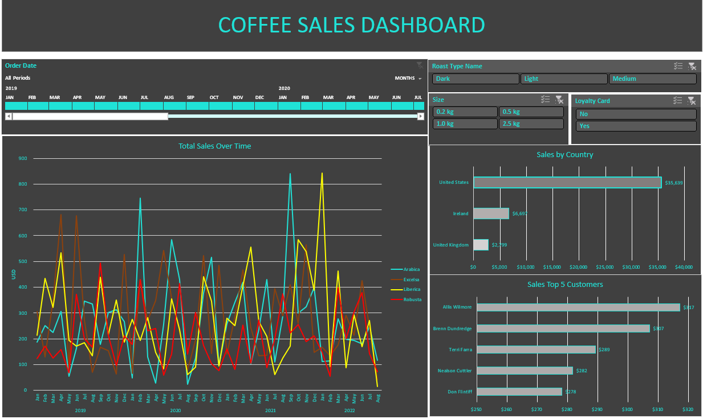

# Coffee Sales Dashboard | Microsoft Excel

An interactive Excel dashboard analysing coffee sales performance across products, 
regions, and customers using pivot tables, slicers, and charts.

---

## 🎯 Objective

To analyse coffee sales data and build a dynamic dashboard that provides quick 
business insights into sales trends, customer behaviour, and regional performance.

---

## 📊 Dashboard Features

- **Total Sales Over Time** — Line chart tracking sales trends across 2019–2022 by coffee type (Arabica, Excelsa, Liberica, Robusta)
- **Sales by Country** — Bar chart comparing revenue across United States, Ireland, and United Kingdom
- **Top 5 Customers** — Bar chart identifying highest revenue-generating customers
- **Interactive Filters** — Timeline slicer, Roast Type, Size, and Loyalty Card slicers for dynamic filtering

---

## 🛠️ Tools & Features Used

- **Microsoft Excel**
- Pivot Tables
- Pivot Charts
- Slicers
- Timeline Filter
- XLOOKUP / INDEX MATCH
- Data Formatting & Cleaning

---

## 🔧 Steps Performed

- Cleaned and structured raw sales, customer, and product data
- Built pivot tables to summarise sales by time, country, and customer
- Designed interactive charts linked to slicers for dynamic filtering
- Created a polished dashboard layout for quick business insights

---
## 📸 Screenshots

---

## 💡 Key Insights

- United States drives the highest revenue at $35,639
- Arabica and Robusta are the most purchased coffee types
- Top customer Allis Wilmore generated $517 in sales
- Sales show clear seasonal peaks across 2019–2022

---

Built with ❤️ using Microsoft Excel
